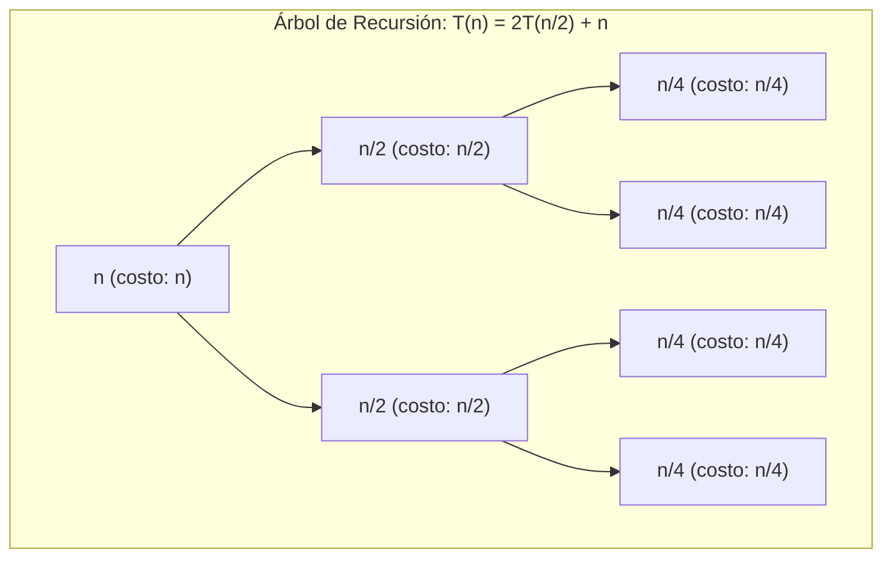

# Implementación del Pipeline Recursivo

## Descripción General

Este documento detalla la implementación del pipeline de análisis de complejidad para **algoritmos recursivos** en el proyecto Agent_Algorithms. El sistema analiza pseudocódigo recursivo y determina su complejidad temporal y espacial utilizando múltiples métodos matemáticos.

## Arquitectura del Pipeline

### Flujo del Grafo

```
generate_ast (mode="recursivo")
       │
       ▼
┌──────────────────┐
│ build_recurrence │  ← Extrae ecuación de recurrencia del AST
└────────┬─────────┘
         │
         ▼
┌────────────────────────────┐
│ costo_temporal_recursivo   │  ← Aplica métodos de solución
└────────┬───────────────────┘
         │
         ▼
┌────────────────────────────┐
│ costo_espacial_recursivo   │  ← Analiza pila + espacio auxiliar
└────────┬───────────────────┘
         │
         ▼
┌─────────────────────┐
│ preparacion_resultado│
└─────────────────────┘
```

## Clasificación de Recurrencias (Formas Tipo)

Basado en la metodología ADA_24A, las recurrencias se clasifican en:

| Tipo | Forma | Estrategia | Ejemplo |
|------|-------|------------|---------|
| F0 | `T(n) = T(n/b) + f(n)` | DyV (un subproblema) | Búsqueda binaria |
| F1 | `T(n) = aT(n/b) + f(n)` | DyV (múltiples subproblemas) | Merge Sort, Quick Sort |
| F2 | `T(n) = aT(n/b) + bT(n/c) + f(n)` | DyV (heterogéneo) | - |
| F3 | `T(n) = T(n-b) + T(n-c) + f(n)` | RyV (bifurcación) | Fibonacci ingenuo |
| F4 | `T(n) = T(n-b) + f(n)` | RyV (lineal) | Factorial |
| F5 | `T(n) = aT(n-b) + f(n)` | RysV (múltiples) | - |
| F6 | `T(n) = aT(n-b) + cT(n-d) + f(n)` | RysV | Fibonacci generalizado |

## Métodos de Solución

### 1. Teorema Maestro (Master Theorem)

**Aplica a:** F0, F1

Para recurrencias de la forma `T(n) = aT(n/b) + f(n)`:

- **Caso 1:** Si `f(n) = O(n^(log_b(a) - ε))` → `T(n) = Θ(n^log_b(a))`
- **Caso 2:** Si `f(n) = Θ(n^log_b(a))` → `T(n) = Θ(n^log_b(a) · log n)`
- **Caso 3:** Si `f(n) = Ω(n^(log_b(a) + ε))` → `T(n) = Θ(f(n))`

```python
# Ejemplo: Merge Sort T(n) = 2T(n/2) + n
# a=2, b=2, f(n)=n
# log_2(2) = 1, f(n) = n = n^1 → Caso 2
# T(n) = Θ(n log n)
```

### 2. Árbol de Recursión

**Aplica a:** F0, F1, F2, F3, F5, F6 (todos excepto F4)

Visualiza la recursión como un árbol y suma el trabajo en cada nivel:

```
                    f(n)                    ← Nivel 0: f(n)
                   /    \
              f(n/b)    f(n/b)              ← Nivel 1: a·f(n/b)
              /  \      /  \
           ...   ...  ...   ...             ← Nivel k: a^k·f(n/b^k)
```

**Complejidad total:** `Σ (trabajo por nivel)` desde nivel 0 hasta profundidad `log_b(n)`

### 3. Método de Iteración (Sustitución Inteligente)

**Aplica a:** F0, F1, F4, F5

Expande la recurrencia k veces hasta encontrar el patrón:

```
T(n) = aT(n-1) + c
     = a[aT(n-2) + c] + c
     = a²T(n-2) + ac + c
     = a²[aT(n-3) + c] + ac + c
     = a³T(n-3) + a²c + ac + c
     ...
     = aⁿT(0) + c·Σ(aⁱ) para i=0..n-1
```

### 4. Ecuación Característica

**Aplica a:** F4, F5, F6

Para recurrencias lineales homogéneas, resolver la ecuación característica:

```python
# Fibonacci: T(n) = T(n-1) + T(n-2)
# Ecuación: r² = r + 1 → r² - r - 1 = 0
# Raíces: r = (1 ± √5) / 2
# φ = (1+√5)/2 ≈ 1.618 (proporción áurea)
# T(n) = Θ(φⁿ) = Θ(1.618ⁿ)
```

### 5. SymPy rsolve

**Aplica a:** Todas (fallback inteligente)

Utiliza el motor simbólico de SymPy para resolver recurrencias:

```python
from sympy import Function, rsolve, symbols

T = Function('T')
n = symbols('n', integer=True, positive=True)

# Fibonacci
recurrence = T(n) - T(n-1) - T(n-2)
solution = rsolve(recurrence, T(n), {T(0): 0, T(1): 1})
```

## Archivos Implementados

### `app/agents/tools/tools_recursivas.py`

8 herramientas para el LLM:

| Herramienta | Descripción |
|-------------|-------------|
| `clasificar_recurrencia` | Identifica tipo (F0-F6) y sugiere métodos |
| `aplicar_master_theorem` | Aplica los 3 casos del teorema |
| `resolver_por_iteracion` | Expande recurrencia k veces |
| `generar_arbol_recursion` | Genera datos del árbol de recursión |
| `resolver_ecuacion_caracteristica` | Resuelve con SymPy rsolve |
| `resolver_con_rsolve` | Solución simbólica directa |
| `analizar_profundidad_recursion` | Calcula profundidad de pila |
| `generar_diagrama_mermaid` | Genera código Mermaid para frontend |

### `app/agents/nodes/recursivo_recurrence.py`

**Nodo:** `build_recurrence_node`

**Propósito:** Extrae la ecuación de recurrencia del pseudocódigo/AST.

**Proceso:**
1. Recibe `state["pseudocode"]` y `state["ast"]`
2. Llama al LLM con modelo Pydantic `RecurrenceAnalysis`
3. Extrae: ecuación raw, casos base, parámetros (a, b, f(n))
4. Actualiza `state["recurrence_info"]`

**Output TypedDict:**
```python
class RecurrenceInfo(TypedDict, total=False):
    raw: str                    # "T(n) = 2T(n/2) + n"
    tipo: str                   # "F1"
    base_cases: list[str]       # ["T(1) = 1"]
    variable: str               # "n"
    parameters: Dict[str, Any]  # {"a": 2, "b": 2, "f_n": "n"}
    methods_applied: list       # Resultados de cada método
    final_temporal: str         # "O(n log n)"
    final_espacial: str         # "O(n)"
```

### `app/agents/nodes/recursivo_temporal.py`

**Nodo:** `costo_temporal_recursivo_node`

**Propósito:** Calcula complejidad temporal usando múltiples métodos.

**Proceso:**
1. Clasifica la recurrencia (F0-F6)
2. Selecciona métodos aplicables según el tipo
3. Aplica cada método y acumula resultados
4. Genera árbol de recursión y diagrama Mermaid
5. Determina O (peor), Ω (mejor), Θ (promedio)

### `app/agents/nodes/recursivo_espacial.py`

**Nodo:** `costo_espacial_recursivo_node`

**Propósito:** Calcula complejidad espacial.

**Proceso:**
1. Analiza profundidad de recursión (pila de llamadas)
2. LLM analiza estructuras auxiliares en el código
3. Combina: espacio = pila + auxiliar
4. Determina O, Ω, Θ espaciales

## Diagramas Mermaid

El sistema genera diagramas Mermaid para renderizar en el frontend:



## Estado del Grafo

Campos añadidos a `AnalyzerState`:

```python
# En state.py
class AnalyzerState(TypedDict, total=False):
    # ... campos existentes ...
    
    # NUEVOS para recursivos
    recurrence_info: RecurrenceInfo
    recursion_tree: RecursionTreeInfo
    mermaid_diagram: str
```

## Ejemplos de Uso

### Factorial
```
Entrada: factorial(n) = n * factorial(n-1)
Recurrencia: T(n) = T(n-1) + O(1)
Tipo: F4
Método: Iteración
Resultado: T(n) = O(n)
```

### Búsqueda Binaria
```
Entrada: buscar(arr, x, low, high)
Recurrencia: T(n) = T(n/2) + O(1)
Tipo: F0
Método: Master Theorem (Caso 2 especial)
Resultado: T(n) = O(log n)
```

### Merge Sort
```
Entrada: mergeSort(arr)
Recurrencia: T(n) = 2T(n/2) + O(n)
Tipo: F1
Método: Master Theorem (Caso 2)
Resultado: T(n) = O(n log n)
```

### Fibonacci
```
Entrada: fib(n) = fib(n-1) + fib(n-2)
Recurrencia: T(n) = T(n-1) + T(n-2) + O(1)
Tipo: F3/F6
Método: Ecuación Característica
Resultado: T(n) = O(φⁿ) ≈ O(1.618ⁿ)
```

## Razonamiento Paso a Paso

El sistema genera un razonamiento detallado almacenado en `state["razonamiento"]`:

```json
{
  "razonamiento": [
    {
      "paso": 1,
      "accion": "Identificación de recurrencia",
      "detalle": "Del pseudocódigo se extrae T(n) = 2T(n/2) + n"
    },
    {
      "paso": 2,
      "accion": "Clasificación",
      "detalle": "Tipo F1 (DyV con múltiples subproblemas)"
    },
    {
      "paso": 3,
      "accion": "Aplicación de Master Theorem",
      "detalle": "a=2, b=2, log_b(a)=1. f(n)=n=n^1. Caso 2 aplica."
    },
    {
      "paso": 4,
      "accion": "Resultado temporal",
      "detalle": "T(n) = Θ(n log n)"
    }
  ]
}
```

## Dependencias

```
sympy>=1.12        # Para rsolve y álgebra simbólica
langchain>=0.2.0   # Para tools y prompts
langgraph>=0.2.45  # Para StateGraph
pydantic>=2.0      # Para modelos estructurados
```

## Testing

Algoritmos canónicos para testing:

1. **Factorial** (F4) → O(n)
2. **Búsqueda Binaria** (F0) → O(log n)
3. **Merge Sort** (F1) → O(n log n)
4. **Quick Sort** (F1) → O(n log n) promedio, O(n²) peor
5. **Fibonacci** (F3/F6) → O(φⁿ)
6. **Torres de Hanoi** (F1) → O(2ⁿ)

## Changelog

- **v1.0.0** (2025-01-XX): Implementación inicial del pipeline recursivo
  - Añadidos 8 tools en `tools_recursivas.py`
  - Nuevo nodo `build_recurrence_node`
  - Reescritura de `recursivo_temporal.py` y `recursivo_espacial.py`
  - Actualización de `graph.py` con nuevo flujo
  - Soporte para diagramas Mermaid
